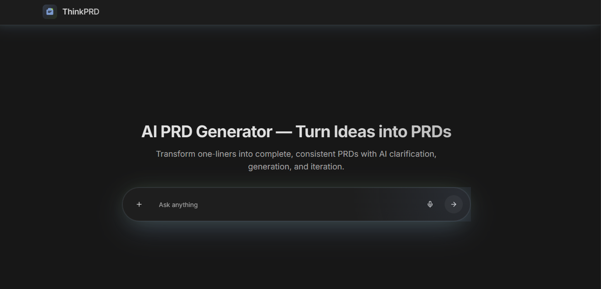

# ThinkPRD Frontend

An AI-powered Product Requirements Document (PRD) generator that transforms simple ideas into comprehensive, structured PRDs with interactive diagrams and real-time collaboration features.



## 🚀 Features

- **AI-Powered PRD Generation**: Transform one-liners into complete, consistent PRDs
- **Interactive Workspace**: Real-time PRD editing with live preview
- **Multiple Diagram Types**: Support for 8 different diagram types including:
  - System Architecture
  - User Flow
  - Data Flow
  - Deployment
  - Database Schema
  - Data Model
  - User Data Structure
  - API Schema
- **Smart Chat Interface**: AI agent for PRD refinement and clarification
- **File Upload & RAG**: Upload PDFs for context-aware PRD generation
- **Real-time Updates**: Live collaboration and progress tracking
- **Export Functionality**: Generate professional PDF exports

## 🛠️ Tech Stack

- **Frontend**: React 18 + TypeScript
- **Build Tool**: Vite
- **UI Framework**: shadcn/ui + Tailwind CSS
- **Routing**: React Router DOM
- **State Management**: React Context + useReducer
- **Diagrams**: Mermaid.js
- **PDF Generation**: jsPDF + html2pdf.js
- **Testing**: Vitest + React Testing Library
- **Code Quality**: ESLint + TypeScript ESLint

## 📦 Installation

### Prerequisites

- Node.js 18+
- npm, yarn, or bun

### Setup

1. **Clone the repository**
   ```bash
   git clone https://github.com/haarry9/ThinkPRD-Frontend
   cd ThinkPRD-Frontend
   ```

2. **Install dependencies**
   ```bash
   npm install
   
   ```

3. **Environment Configuration**
   ```bash
   cp .env.example .env.local
   ```

   Update `.env.local` with your API configuration:
   ```env
   VITE_API_BASE_URL=http://localhost:8000
   ```

4. **Start the development server**
   ```bash
   npm run dev
   ```

5. **Open your browser**
   Navigate to `http://localhost:5173`

## 🏗️ Project Structure

```
src/
├── components/          # Reusable UI components
│   ├── ui/             # shadcn/ui components
│   ├── chat/           # Chat interface components
│   ├── session/        # Session management components
│   ├── diagrams/       # Diagram-related components
│   └── prd/            # PRD-specific components
├── contexts/           # React contexts for state management
├── hooks/              # Custom React hooks
├── pages/              # Page components
├── services/           # API service layer
├── types/              # TypeScript type definitions
├── utils/              # Utility functions
└── lib/                # Library configurations
```

## 🎯 Usage

### Creating a New PRD

1. **Start with an Idea**: Enter your product idea in the main input field
2. **AI Clarification**: The AI will ask clarifying questions to understand your requirements
3. **PRD Generation**: Watch as your PRD is built section by section
4. **Interactive Editing**: Refine sections using the built-in editor
5. **Diagram Generation**: Generate various diagrams to visualize your product
6. **Export**: Download your completed PRD as a professional PDF

### Workspace Features

- **PRD Editor**: Rich text editor with real-time preview
- **Flowchart View**: Interactive diagrams with zoom and pan
- **Chat Panel**: AI assistant for refinements and questions
- **Progress Tracking**: Visual progress indicators for each section
- **File Uploads**: Add context documents for better PRD generation

## 🔧 Available Scripts

```bash
# Development
npm run dev              # Start development server
npm run build            # Build for production

## 🌐 API Integration

This frontend is designed to work with the ThinkPRD backend API. Key integration points:

- **Session Management**: Create and manage PRD sessions
- **Real-time Updates**: Server-Sent Events for live updates
- **File Processing**: PDF upload and RAG integration
- **Diagram Generation**: AI-powered diagram creation
- **Export Services**: PDF generation and download

## 🎨 Customization

### Theming

The application uses a dark theme by default (Cursor IDE style). Customize themes in:
- `src/index.css` - Global styles
- `tailwind.config.ts` - Tailwind configuration
- `src/components/ui/` - Component-specific styles

### Adding New Diagram Types

1. Update the diagram type definitions in `src/types/`
2. Add new diagram components in `src/components/diagrams/`
3. Update the diagram service in `src/services/diagramService.ts`

## 🧪 Testing

```bash
# Run all tests
npm run test

# Run tests in watch mode
npm run test:watch

# Run tests with coverage
npm run test:coverage

# Run tests with UI
npm run test:ui
```


## 🚀 Deployment

### Build for Production

```bash
npm run build
```

The build artifacts will be stored in the `dist/` directory.

### Environment Variables

Set the following environment variables for production:

```env
VITE_API_BASE_URL=https://your-api-domain.com
```


## 📄 License

This project is licensed under the MIT License - see the [LICENSE](LICENSE) file for details.
